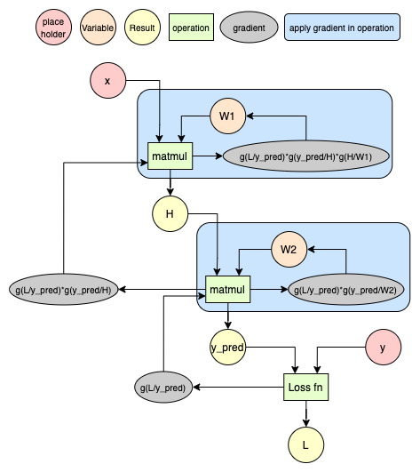
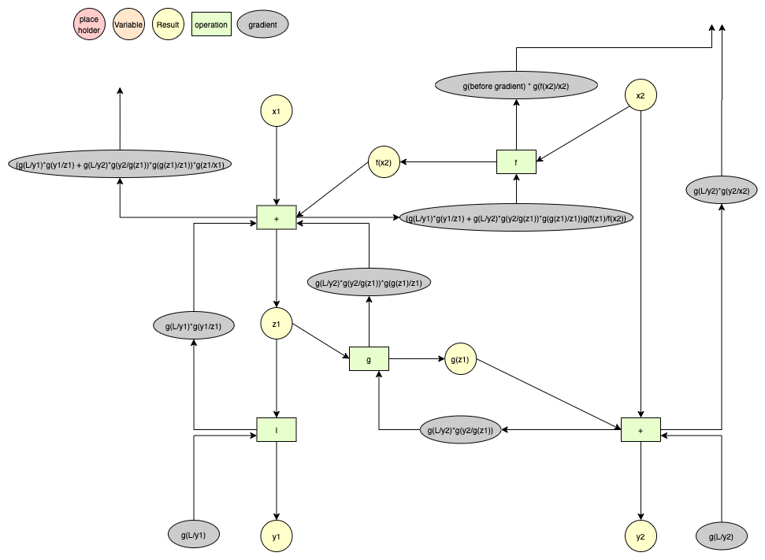
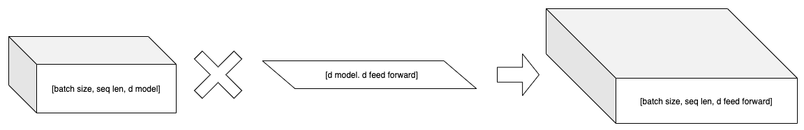
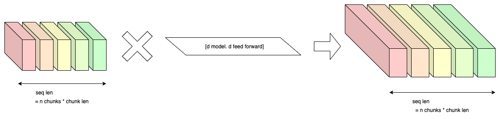
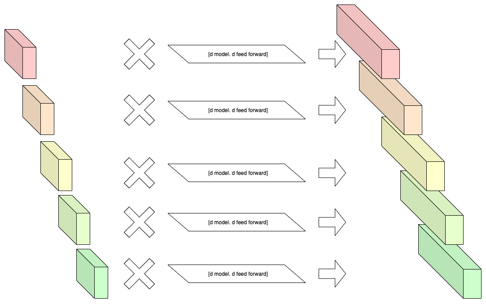

# Reformer

[toc]

---

## What is "Reformer"?

- Reformer는 transformer의 구조를 효율적으로 변환한 구조
    - Transformer based model들은 구조가 깊고 파라미터 수가 많아 cpu나 단일 머신에서 돌리기 어려움
    - Transformer 구조에서 발생하고 있는 비효율적인 부분들을 개선하여 만든 구조

### How to?

Method1 : Reversible residual network

Method2 : Chunk feed forward layer

Method3 : Locality-sensitive hashing attention

---

## Method1 : Reversible Residual Network

### abstract

- 일반적으로, 한 operation에서 발생하는 gradient는 두 가지가 있다.
    1. 이전 operation으로 넘겨주는 gradient
    2. operation 내부의 variable을 update할 때 사용되는 gradient
- 보통의 방식으로 연산을 진행하면, backpropagation을 할 때 두 gradient를 구하기 위해 input과 variable들이 메모리에 저장된다.
- Revnet의 아이디어는 operation의 output을 통해 input을 구해, input을 저장할 필요가 없도록 하자는 것에서 나온다.

### How to?

#### Foward

- Revnet의 핵심이 되는 수식은 다음과 같다.

$$
y_1 = x_1 + F(x_2) \\
        y_2 = x_2 + G(y_1)
$$

- 위 수식에서 $x_1$과 $x_2$는 layer의 input이다. $F$와 $G$는 layer 안에 정의된 operation들이다. layer의 output은 $y_1$, $y_2$이다.
- 위 수식을 이용하면, $y_1$과 $y_2$를 이용하여 다음과 같이 $x_1$과 $x_2$를 구할 수 있다.
    $$
    x_2 = y_2 - G(y_1) \\
    x_1 = y_1 - F(x_2)
    $$

- 이렇게 output을 이용하여, input을 구할 수 있으니 input 값들을 따로 저장할 필요가 없어진다.

- 또, block들을 여러개 쌓을 때, 각 각의 block의 output을 모두 저장하지 않고, 마지막 block의 output만 저장한다면, 각 block들의 input을 차례로 구할 수 있다.

#### Backward

- backpropagation 상황에서 하나의 block에서 일어나는 일을 살펴보자. 
- Revnet의 한 block 내 각 operation들의 출력값을 모두 나타낸 graph는 다음과 같다.

- 한 block에 도착하는 gradient는 block의 output의 gradient들이다. : `g(L/y1), g(L/y2)`
- 또, backpropagation 시에 다음 블럭의 input, 즉 현 블럭의 output들이 다음 블럭을 통해 구해진다. : `y1, y2`
    - 마지막 block이라면 따로 메모리에 저장한 값
- 이 4가지 정보를 이용해 g와 f의 variable에게 전해지는 gradient, 이전 block에 전해줘야하는 gradient와 $x_1$과 $x_2$를 구할 수 있다.

### Result

결과적으로 forward 시 input들을 저장하지 않고 backpropagation을 실행할 수 있다. 만약 layer의 개수가 N이라면 N개의 input 값들을 저장하지 않고, 마지막 block의 output만 메모리에 저장하면 된다.

---

## Method2 : Chunk Feed Forward Layer

### abstract

- attention layer를 나온 텐서를 생각해보면, `[batch size, sequence len, d model]`의 shape를 가지고 있다.
- 이를 `[d model, d feed forward]`, `[d feed forward, d model]`의 shape를 갖고 있는 dense layer들을 통과시켜야한다.
- 이 때 발생하는 matrix multiplication은
    - `[sequence len, d model] * [d model, d feed forward]`, 
    - `[sequence len, d feed forward] * [d feed forward, d model]`이다. 

- 만약 sequence length가 매우 크다면 이 matrix multiplication을 메모리에 올리는 것은 불가능할 것이다.
- Chunk feed forward layer를 이용하면 이 matrix multiplication에 사용되는 메모리를 줄일 수 있다.

### How to?

- Chunk feed forward layer의 아이디어는 feed forward 과정에서는 token들이 서로에게 영향을 끼치지 않는다는 것에서 나온다.

- 위와 같은 feed forward 연산은 token들 사이에 서로 영향을 주고 받지 않고 계산된다. 따라서 밑에 그림처럼 input의 sequence를 분할하여 feed foward 연산을 하고 다시 concat한다면 원래 결과와 같은 값을 얻을 수 있다.

- 이러한 chunk feed forward 연산을 통해 feed foward에 필요한 matrix multiplication 연산을 모두 메모리에 올리지 않고 진행하므로서 메모리를 아낄 수 있다.

### Result

결과적으로 연산량은 똑같지만 한번에 메모리에 올라가는 데이터의 양을 줄일 수 있다.

---

## Method3 : Locality-Sensitive Hashing Attention

### abstract

- attention score를 구할 때는 query matrix와 key matrix의 matrix multiplication이 필요하다. 
- 하지만 이 matrix multiplication의 결과는 `[sequence len, seqence len]`만큼의 데이터를 가지고 있다.
- 이 matrix의 크기는 sequence가 늘어날 수록 제곱배로 늘어나므로 기존 방식대로 attention score를 구한다면 seqence의 길이를 충분히 늘릴 수 없다.
- 하지만 생각해보면 사실 중요한 것은 attention score matrix가 아니라 결과로 나오는 attention value이다.
- Locality-sensitive hashing attention은 attention value를 approximate하는 방법 중 하나이다.
- Locality-sensitive hashing attention을 사용하기 위해서는 두 가지 가정이 필요하다.
    - 가정 1 : attention value는 몇몇의 특정 value에 의해 dominate된다.
    - 가정 2 : 자기 자신과 비슷한 token들의 attention score가 높다.

- 두 가지 가정이 성립한다면 다음과 같은 추론을 할 수 있다.
    - 자기 자신과 **비슷한 token**들에게만 attention score를 구해 attention value를 구하면 full attention value를 approximate할 수 있다.

### How to?

- '비슷한 token들'이란?
    - '비슷한 token들'이란 embedding space에서 '비슷한 위치에 있는 token들'을 뜻한다.
    - 논문에서는 '비슷한 위치에 있는 token들'을 임의의 projection을 통해 현 space보다 낮은 차원으로 보냈을 때, 가장 가까운 축이 동일한 것으로 정의한다.
        - 한 직선이더라도 원점으로 부터의 direction이 다르면 다른 축으로 정의
- 비슷한 token을 정의했다면 다음과 같은 스탭으로 attention score를 구한다.
    1. 한 sequence에서 비슷한 token끼리 모일 수 있도록 sorting한다.
    2. sorting한 결과를 일정 길이로 나눈다.
        - 일정한 길이 : bucket length

        - 나눠진 덩어리 : bucket
    3. 하나의 bucket 안에서 token들끼리 attention하고 attention value를 구한다.
        - 비슷한 token이 많아 한 bucket에 속하지 못하고 주변 bucket에 속할 수도 있다.
            - 이를 위해 주변 bucket의 token들도 attention할 수도 있다.
                - 논문에서는 자기 자신 bucket과 바로 앞 bucket의 token들까지 attention한다.
                    - 첫 번째 bucket의 '앞'은 맨 뒤에 bucket으로 정의한다.

### Result

결과적으로 memory와 time complexity를 다음과 같이 표현할 수 있다.

| Attention Type   | Memory Complexity                   | Time Complexity                     |
| ---------------- | ----------------------------------- | ----------------------------------- |
| Normal Attention | $max(bn_hld_k, bn_hl^2)$            | $max(bn_hld_k, bn_hl^2)$            |
| LSH Attention    | $max(bn_hld_k, bn_hln_r(4l/n_c)^2)$ | $max(bn_hld_k, bn_hln_r(4l/n_c)^2)$ |

이 table이 보여주는 것은 LSH Attention을 통해 memory나 time complexity에서 효과를 보려면 $n_r$(hash 표현의 회수)을 적게, $l/n_c$(bucket의 길이)를 적게 하면 된다는 것이다.

## Result

Reformer는 3가지 기법을 통해 기존 transformer를 효율적으로 변형한 모델이다. 각각의 메모리를 절약하는 방법들은 성능을 크게 떨어트리지 않아, 기존 모델들 보다 더 큰 모델을 만들거나, token의 개수가 512가 넘는 더 긴 문장에 대해 학습하고 문장을 만들어낼 수도 있다.

