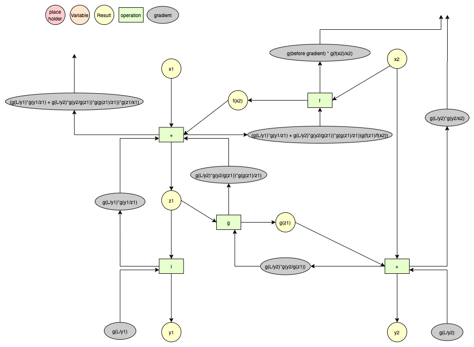

# Reformer Implementation

[toc]

## Files

```
└── reformer
    ├── attentions.py
    ├── chunkfeedforward.py
    ├── decoder.py
    ├── embeddings.py
    ├── reformer.py
    └── reversible.py  # 삭제 예정
```

## module calls


## Reformer


## Decoder


## Revnets



